# Monitoring devices

The exact set of devices depends on what your server reports. Nothing is created for hardware the iDRAC does not describe, and **a sensor that reports no reading produces no device at all**, rather than a device reading zero.

!!! note
    Screenshots here use the [Machinon theme](https://domoticz.github.io/Machinon/). Device names and values are identical on the stock theme; only the presentation differs.

Every non-temperature device the plugin created for one PowerEdge, on Domoticz's Utility tab:

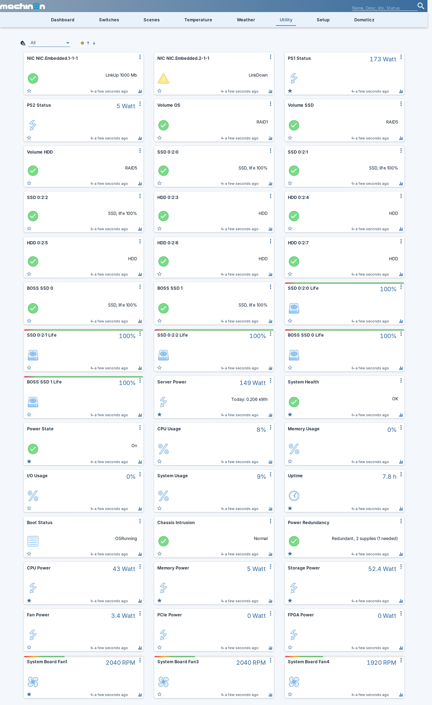

## What you can expect to see

The example values below come from that same machine: a tower PowerEdge with three fans, two power supplies, three RAID volumes, two NIC ports and ten drives. Yours will differ in the per-hardware rows, because those follow what your server has. Fans, drives, volumes and NICs are re-discovered on every slow poll, so hardware you add later appears on its own.

### Always, where the server reports the value

| Device | Domoticz type | Example reading |
|---|---|---|
| Server Power | kWh | `160 Watt`, plus a kWh counter such as `0.176 kWh` |
| System Health | Alert | `OK` in green, or the iDRAC's own fault text such as `Power supply redundancy is lost.` in red |
| Power State | Alert | `On` in green, `Off` in grey |
| Inlet Temp | Temperature | `27.0 C` |
| Exhaust Temp | Temperature | `34.0 C` |
| CPU Usage | Percentage | `8%` |
| Memory Usage | Percentage | `0%` |
| I/O Usage | Percentage | `0%` |
| System Usage | Percentage | `9%` |
| Uptime | Custom, hours | `7.4 h` |
| Boot Status | Text | `OSRunning` |
| Chassis Intrusion | Alert | `Normal` in green |
| Power Redundancy | Alert | `A/B Grid Redundant, 2 supplies (1 needed)` |

### One per piece of hardware found

| Device | Domoticz type | Example name and reading |
|---|---|---|
| CPU temperature, one per socket | Temperature | `CPU1 Temp` reading `53.0 C` |
| Hottest DIMM | Temperature | `Max DIMM Temp` reading `42.0 C` |
| Fan speed, one per fan | Custom, RPM | `System Board Fan1` reading `1920 RPM` |
| Power supply, one per PSU | Usage, watts | `PS1 Status` reading `150.5 Watt`, with the health the server reports in its description, `OK` or `Critical` |
| RAID volume, one per virtual disk | Alert | `Volume OS` reading `RAID1` |
| Physical drive, one per disk | Alert | `SSD 0:2:0` reading `SSD, life 100%`, or `HDD 0:2:3` reading `HDD` |
| NIC port, one per port | Alert | `NIC NIC.Embedded.1-1-1` reading `LinkUp 1000 Mb`, or `LinkDown` in amber |

### Optional, off by default

| Device | Domoticz type | Example | Turned on by |
|---|---|---|---|
| Drive life, one per drive that reports it | Percentage | `SSD 0:2:0 Life` reading `100%` | [Drive life % devices](settings.md#drive-life-devices) |
| Power Control | Selector switch | `Idle`, then the action you pick | [Allow Control](control.md) |
| Identify LED | Switch | `Off` | [Allow Control](control.md) |

### Only where the iDRAC licence allows it

| Device | Domoticz type | Example reading |
|---|---|---|
| CPU Power | Usage, watts | `51 Watt` |
| Memory Power | Usage, watts | `5 Watt` |
| Storage Power | Usage, watts | `57.8 Watt` |
| Fan Power | Usage, watts | `3.4 Watt` |
| PCIe Power | Usage, watts | `0 Watt` |
| FPGA Power | Usage, watts | `0 Watt` |
| GPU power, one per card | Usage, watts | `GPU Video.Slot.10-1 Power` reading `39.1 Watt` |
| GPU temperature, one per card | Temperature | `GPU Video.Slot.6-1 Temp` reading `40.0 C` |

On a seven-card server that is fourteen GPU devices, named by the slot each card sits in. See [Per-component power](#per-component-power-needs-a-licence) for what unlocks these.

### What it looks like when something is wrong

Colour comes from the Domoticz alert level, so a problem is visible on the dashboard without opening anything:

| Device | Reading | Colour | What it means |
|---|---|---|---|
| System Health | `Power supply redundancy is lost.` | red | The iDRAC has raised a fault and this is its own wording |
| System Health | `Critical: PS, SEL` | red | A fault is raised but the iDRAC gave no message, so the affected subsystems are named instead |
| System Health | `Unknown` | grey | Nothing is reporting health, which is normal while the host is powered off |
| PS1 Status | `0 Watt`, description `Critical` | | A failed or unplugged supply. The watts alone mean nothing here, the description is the signal |
| Power Redundancy | `Redundancy lost` | red | The group is present and unhealthy |
| Power Redundancy | `Not reported` | grey | The iDRAC dropped the group entirely, which is what pulling a supply does |
| HDD 0:2:5 | `HDD, failure predicted` | amber | The drive's own SMART prediction |
| HDD 0:2:9 | `HDD, life 4%` | amber | Below your **Drive life warning (%)** setting |
| NIC NIC.Embedded.2-1-1 | `LinkDown` | amber | The port is down. A port with no link state at all reads grey `Unknown` |
| Power State | `Off` | grey | Deliberately grey, not red: a server you shut down is not a fault |
| Power Redundancy | `Not redundant (configured)` | grey | Redundancy is switched off on the server, so the missing group is intended rather than a fault |

Four of those, as they actually appear:

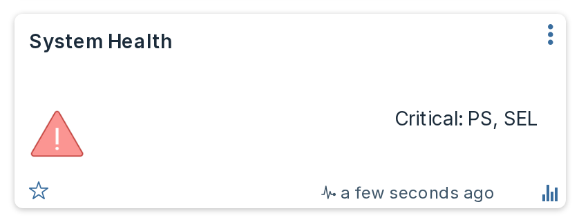

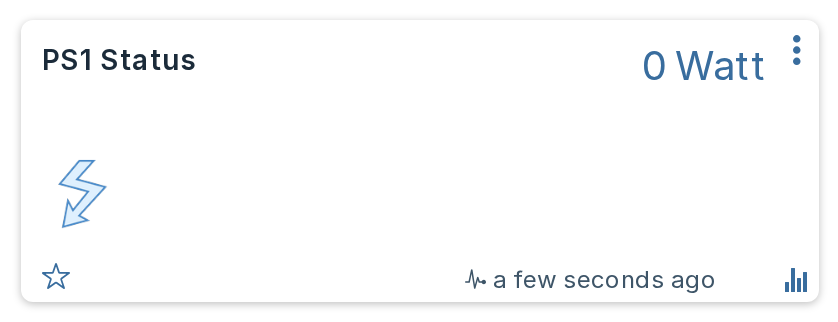

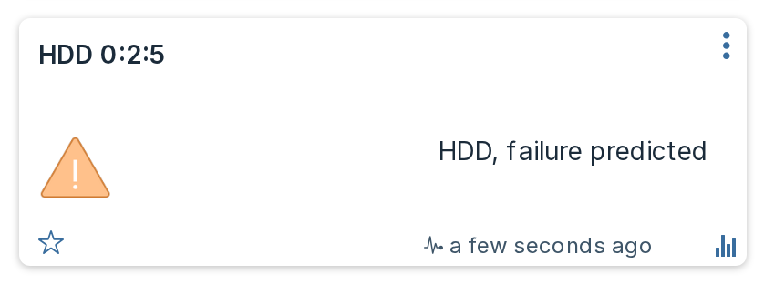

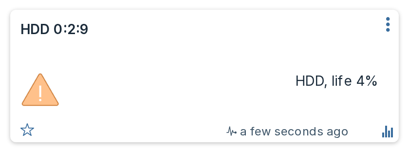

## Storage device names and options

### Drive names

Dell names drives differently depending on which controller they sit behind, which reads badly when both appear in one list: a PERC calls a drive `Solid State Disk 0:2:0` while a BOSS boot card calls its pair `SSD 0` and `SSD 1`. The plugin shortens the long form and marks the boot card, so you get `SSD 0:2:0`, `HDD 0:2:3` and `BOSS SSD 0`.

A drive in pass-through mode keeps that qualifier, because it says something real about how the disk is attached: `NonRAID Solid State Disk 0:1:0` becomes `NonRAID SSD 0:1:0` rather than losing the word.

**NVMe drives are named as such.** Dell reports one with `MediaType: SSD`, exactly like a SATA disk, and calls it `PCIe SSD in Slot 23 in Bay 2`; only the bus protocol distinguishes the two. Where the server reports a PCIe or NVMe protocol, the plugin uses `NVMe in Slot 23 in Bay 2` instead. The rename is driven by the reported protocol and never by the name, so a drive that merely reads like a PCIe device but is attached by SAS keeps the name the server gave it.

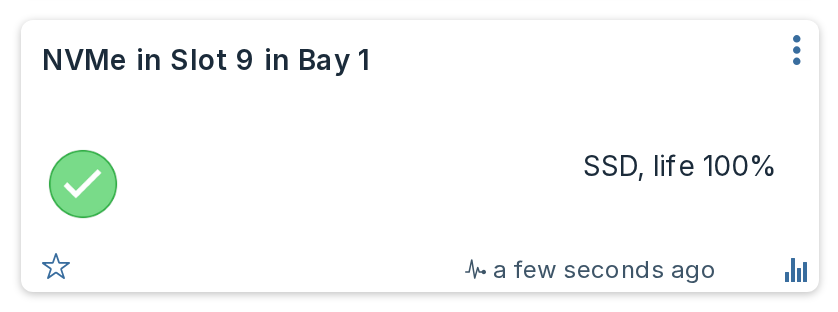

The media type comes from the server, so a bay holding a mix stays correctly labelled. A drive whose name is not one of Dell's known forms is left exactly as the server reports it.

### Drive life devices

Switching on **Drive life % devices** in [Settings](settings.md#drive-life-devices) adds a second device per drive, named after the drive with ` Life` appended, reporting predicted media life as a percentage. It exists because the drive's own tile is an Alert, and Domoticz will not graph an Alert, so without it the life figure is readable but never plotted.

It is off by default, and only drives that report a life figure get one, which in practice means SSDs. Each one carries a [bar](#bar-graphs) that turns red below your **Drive life warning (%)** setting.

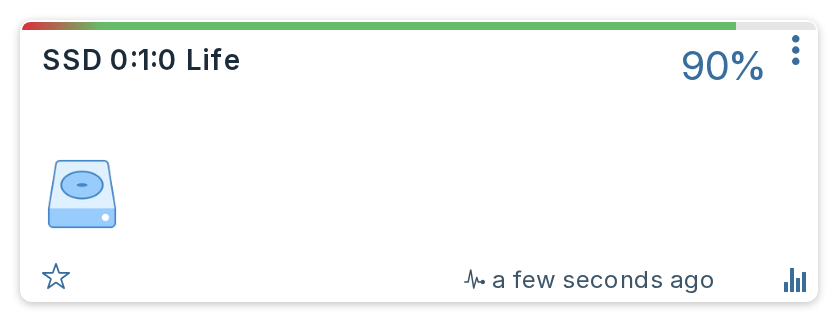

The same device for an NVMe drive, which reports life just as a SAS or SATA SSD does:

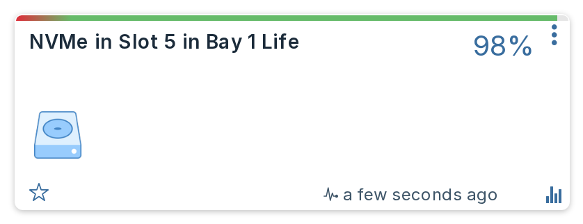

## Thresholds in the description

Temperature and fan devices carry the server's own warning and critical thresholds in the device description, so you can see the limits without looking them up:

```
Inlet Temp        warning below 3 C; critical below -7 C; warning above 33 C; critical above 42 C
System Board Fan1 warning below 840 RPM; critical below 480 RPM
CPU1 Temp         critical below 3 C; warning above 83.3 C (estimated); critical above 98 C
```

A threshold marked **`(estimated)`** was not reported by the server. The plugin derives it from the critical threshold so a warning band exists at all. Reported values are never labelled this way, so an estimate can never be mistaken for something the server actually said.

A sensor the server publishes no thresholds for gets no description at all, rather than an invented one. `Max DIMM Temp` is commonly one of those.

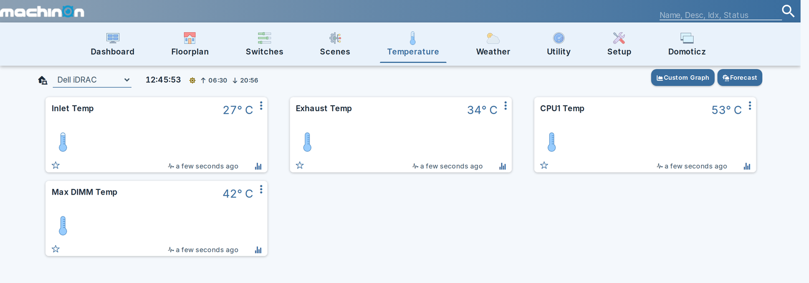

`Max DIMM Temp` above is the one without a bar or a description: this server publishes no thresholds for it, so there is nothing to draw.

## Bar graphs

Where the server reports thresholds, they also become a coloured bar across the top of the device card, so the safe band is visible at a glance instead of being read out of the description text.

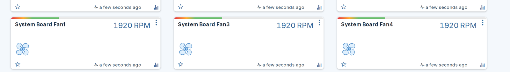

Three kinds of device get one:

| Device | Bands drawn from |
|---|---|
| **Fans** | Red below the critical speed, amber up to the warning speed, green from there to the [fan bar maximum](settings.md#why-the-fan-bar-maximum-is-a-setting) you set. |
| **Temperatures** | The server's own lower and upper critical limits, with amber warning bands where it reports them. Only sensors that report **both** critical limits get a bar, because those two define the axis. |
| **Drive life** | Red below your **Drive life warning (%)** setting, green above it, on the 0 to 100 axis a percentage inherently has. |

**Nothing else gets a bar.** Utilization percentages, power supply wattage, the per-component power devices and the energy counter carry no server-reported thresholds, so any bands there would be invented rather than measured.

A **synthesized** threshold is never drawn. The description labels an estimated warning limit `(estimated)`, but a coloured band carries no label, so drawing one would present a guess as a reported limit. That is why the description and the bar can legitimately disagree on a sensor whose warning threshold the server omits.

!!! note "Bar graphs need a beta or development Domoticz build"
    They rely on a plugin being able to write the `Color` field ([domoticz/domoticz#6968](https://github.com/domoticz/domoticz/pull/6968), merged 19 August 2026). That fix is **not in any stable release yet**, 2026.3 included, so on a stable build Domoticz discards the value, the cards show no bar and nothing is logged. Everything else on this page is unaffected.

!!! info "Your own bands are safe"
    Bands are written when a device is created, and refreshed afterwards when the underlying thresholds or your settings change. That refresh only happens while the bands are still the ones the plugin last wrote. Edit a device's bar by hand and the plugin stops touching it, the same rule it follows for names and icons.

## Per-component power (needs a licence)

Dell can break system power down by subsystem, and where it is available the plugin creates six more devices:

| Device | Metric |
|---|---|
| CPU Power | `TotalCPUPower` |
| Memory Power | `TotalMemoryPower` |
| Storage Power | `TotalStoragePower` |
| Fan Power | `TotalFanPower` |
| PCIe Power | `TotalPciePower` |
| FPGA Power | `TotalFPGAPower` |

Typical idle figures on a well-populated tower server: CPU 51 W, storage 58 W, memory 5 W, fans 3.4 W. The storage figure is often the surprise, since a full drive bay can draw more than the processor.

!!! warning "This needs a licence, and most machines will not have one"
    The data comes from Dell's telemetry service, which is licence-gated. There are two routes to it, and the plugin supports both because it selects a report by its contents rather than by its name:

    - **iDRAC Datacenter.** Unlocks Dell's own built-in telemetry reports, including `PowerMetrics`, directly on the iDRAC.
    - **OpenManage Enterprise Advanced.** Unlocks the OpenManage Enterprise **Power Manager** features, and it is Power Manager's own reports (`OME-PMP-Power-A` and friends) that the plugin reads on such a machine. Dell's built-in reports stay locked there and answer with a licence error, which is exactly why the report is chosen by content.

    On an iDRAC with neither, the devices simply do not appear and everything else works exactly as before.

    The plugin asks once per start. If the answer is no, it stops asking and logs a single line saying so, rather than wasting a request on every poll.

### Switching telemetry on

Telemetry also has to be enabled on the iDRAC, and it is off by default. Two attributes matter: the master switch `Telemetry.1.EnableTelemetry` and the report itself `TelemetryPowerMetrics.1.EnableTelemetry`, both set to `Enabled`.

You can set them yourself from the iDRAC interface or with `racadm`, or you can switch on **Configure iDRAC telemetry** in [Settings](settings.md#configure-idrac-telemetry) and let the plugin do it. That setting is off by default and is the only thing in the plugin that writes configuration to your server; it acts only when per-component power was already found to be unavailable, so it will not disturb a machine where OpenManage already owns that configuration.

### Which report the metrics come from

Report names are **not** fixed. A Datacenter iDRAC serves Dell's built-in `PowerMetrics`, while a machine managed by OpenManage Enterprise carries the Power Manager Plugin's own reports, `OME-PMP-Power-A` and friends, and answers the built-in names with a licence error.

So the plugin looks at what each report on your machine actually contains, rather than at what it is called, and uses the ones carrying the metrics it needs. You do not have to tell it which licence you have.

When telemetry **is** available, the Server Power device also switches to reporting `SystemInputPower`, which is what the wall socket actually delivers, rather than the mainboard sensor. That is typically a few percent higher, for example 160 W at the wall against 144 W at the board. Note that this makes a visible step in the energy graph at the point it switches over.

### Power supply efficiency

Where a supply reports both the AC it draws and the DC it delivers, the plugin adds a `PS1 Efficiency` device showing the ratio as a percentage. One per supply that reports both figures.

This is real conversion loss, not an estimate. Measured across a fleet: a PowerEdge R750 under load ran at 93.3%, while an R440 idling at 32 W managed only 75.0%. That drop is expected and is the reason the device is interesting: a switching supply is least efficient when barely loaded, so a lightly used server wastes a larger share of what it draws than a busy one.

No device appears when the figure would be meaningless, and nothing is written rather than a zero recorded:

- **A supply on standby.** On a grid-redundant pair the idle feed reads a few watts in and zero out. That supply is doing nothing; it is not 0% efficient.
- **Too light a load.** Below 25 W of input the ratio is mostly measurement granularity, because input is reported in whole watts and output in quarter watts.
- **More output than input**, which cannot happen and means the sensor is wrong.

A supply that never carries meaningful load therefore never gets an efficiency device at all, rather than getting one that sits empty.

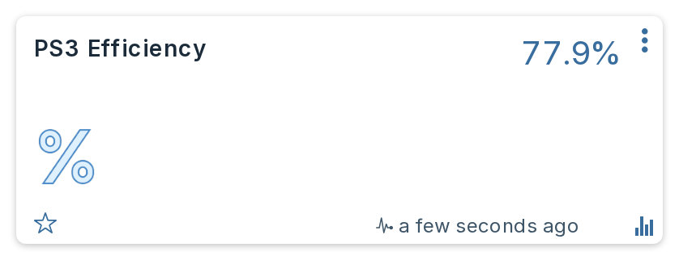

### GPUs

Where telemetry reports them, each GPU gets a power device and a temperature device, named `GPU <slot> Power` and `GPU <slot> Temp`. Power is reported in milliwatts and converted, so a card drawing 39100 mW shows as 39.1 W.

Cards are identified by the slot the server reports, including sub-indices, so a multi-GPU card occupying one slot appears as `Video.Slot.7-1` through `Video.Slot.7-4` rather than collapsing into one. A card that reports only one of the two figures gets only that device.

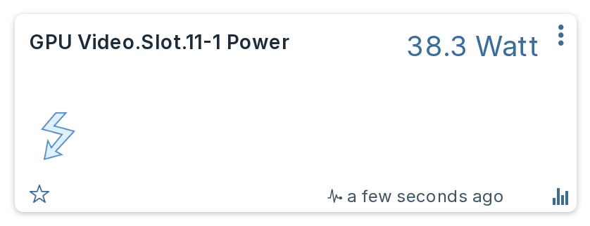

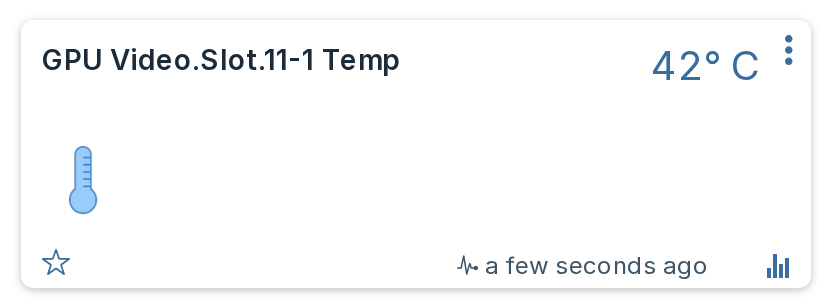

#### Without a telemetry licence

Telemetry is licence-gated, but a GPU's temperature is usually also in the ordinary sensor list, where it costs nothing. When telemetry reports no cards, the plugin falls back to any sensor the server tags with the Redfish physical context `GPU` and creates a temperature device from it, under the name the server gives it, such as `GPU Temp 8` or `System Board SLOT5 Temp`.

This is a fallback, never an addition: where telemetry does report cards, these sensors describe the same hardware again, so they are ignored rather than doubling every card's temperature device.

It is temperature only. Per-card wattage still needs telemetry, because the sensor that carries GPU board power is not tagged with a physical context and could only be found by matching Dell-specific sensor ids, which would break on any other vendor.

Measured on a PowerEdge R750 whose telemetry reported no GPU at all: the fallback found a card running at 74 °C that was previously invisible.

## System Health

This is deliberately a single tile rather than one per subsystem, because a wall of green tiles is not information.

Its level is the worst of the standard Redfish health rollup and Dell's own OEM rollups. Its text is the part that matters:

- When the iDRAC has raised a fault, the tile shows **the iDRAC's own message**, for example `Power supply redundancy is lost.`
- When there is no fault message, it falls back to naming the unhappy subsystems.
- When everything is healthy, it reads `OK`.

!!! info "Why the fault text matters so much"
    Dell's health rollups track **raised faults**, not instantaneous component state, so the tile can stay red for hours while every single component, both power supplies included, reports `Status.Health: OK`. Without the fault sentence you would be looking at a red square with nothing behind it that you could act on.

## Power redundancy

Reports the health of the redundancy **group**, which is a different question from whether each PSU is healthy. It can read Critical while both power supplies individually read OK, which is exactly the condition a per-component view cannot show you.

It reads in plain English rather than in Redfish terms, and it leads with **the policy the server is actually configured for**, for example `A/B Grid Redundant, 2 supplies (1 needed)`. The policy, the number of supplies in the set and the number needed all come from the server. A fault reads `Redundancy lost` or `Redundancy degraded` instead: when redundancy is gone, what you need on screen is the failure, not the setting that is no longer being met.

A server that reports no policy at all, which is any non-Dell Redfish endpoint, falls back to the generic Redfish mode and reads `Redundant, 2 supplies (1 needed)`.

!!! note "Hot Spare appears on the end"
    With **Hot Spare** switched on, the iDRAC parks some supplies on standby and lets the ones you nominate as **Primary** carry the whole load. The device names the primaries, which is what explains a healthy set where one supply reads a few watts and another reads everything:

    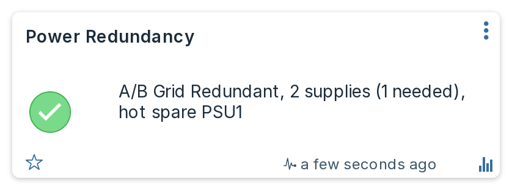

    The pair it describes, on the same server at the same moment. Neither supply is faulty:

    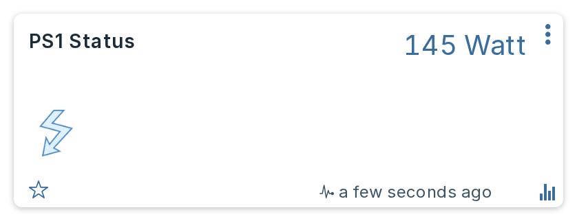

    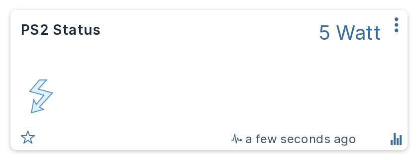

    The supply named is the one **carrying** the load, not the one parked. Measured on a four-supply DSS8440 nominating `PSU1 and PSU3`: those two delivered 288 W and 307 W while PSU2 and PSU4 sat at exactly 0 W.

    Hot Spare is only shown alongside a redundant policy, and even then it describes the **configuration** rather than proving a supply is parked. Switching it on while the policy is **Not Redundant** left the supplies sharing the load evenly on four servers, and the same DSS8440 under a **PSU Redundant** policy also shared across all four with Hot Spare still on. Only the grid policy actually parked anything on the machines measured.

!!! note "When a supply fails"
    A failed supply is **not** removed from the iDRAC's inventory. It stays listed, drawing 0 W and reporting `Critical`, and the redundancy group stays with it and goes Critical too, so the device reads a red `Redundancy lost`. Verified by pulling a mains cord on a live T550: the supply went to 0 W and `UnavailableOffline`, and the iDRAC raised two faults, `Power supply redundancy is lost.` and `The input voltage for the Power Supply Unit PSU.Slot.1 is not detected.`

    That holds whether the supply lost its input or failed outright. Taking one out of its bay reads the same way: the iDRAC keeps reporting the supply it knows about, and stays red.

    **Restarting the iDRAC re-inventories the chassis.** If a supply is physically gone at that point, the iDRAC counts only the supplies actually present and treats that as the new normal, so the fault clears and the device goes healthy for the smaller set. Put the supply back and the next inventory picks it up again. Nothing the plugin does causes this; it reports what the server reports.

    System Health carries the iDRAC's own fault text throughout, which is where the reason lives.

!!! note "When redundancy is switched off"
    An empty redundancy group has a second, entirely benign cause: the server is **configured** not to be redundant, which is common on machines that need every supply delivering at once. The plugin reads Dell's own policy attribute to tell the two apart, and says so rather than leaving you to guess:

    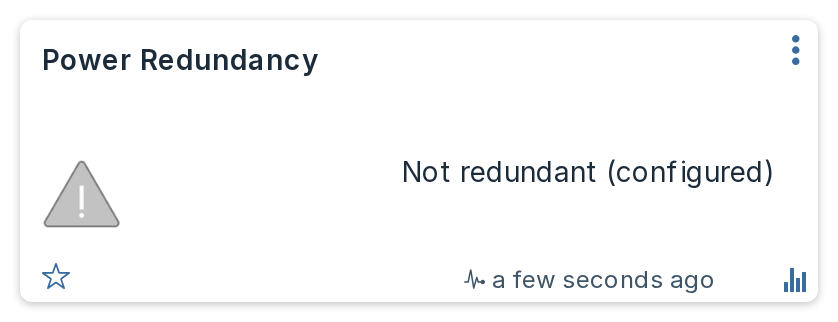

    Still grey rather than green. Not redundant is an intended state, not a healthy one to advertise.

Only the first redundancy group is reported. Chassis that expose several groups will show only one. The device comes from the same payload as the power supplies, so it stops updating if you switch **Power supplies** off in [Settings](settings.md#devices).

## Energy

The Server Power device carries both live watts and an accumulating kWh counter that the plugin integrates itself from the measured wattage.

It does **not** use the lifetime energy figure the iDRAC reports. That counter does not accumulate continuously: it works out to a lifetime average far below what the machine really draws, so it must pause across power-off periods or reset. Wiring it to a Domoticz counter would produce a graph with invented plateaus and sudden jumps.

The trade-off is that energy accrued while Domoticz is not running is not recovered. The counter is guarded so it can only move forwards, and an implausibly large jump is held back and reported rather than accepted.

## Power supply devices show input watts

A PSU device shows what the supply draws from the wall, which includes conversion loss, rather than what it delivers to the board.

!!! warning "A PSU reading near 0 W is often completely normal"
    On a server with **Hot Spare** switched on, the supplies nominated as **Primary** carry the load while the rest idle near zero. Wattage alone is therefore **not** a fault signal, and the plugin never treats it as one. Health comes from the supply's reported status and from Power Redundancy, which names the supplies carrying the load so you can tell an idle standby apart from a failure at a glance.

    What tells you a supply has actually failed is **System Health**, which turns red and carries the iDRAC's own sentence, for example `The input voltage for the Power Supply Unit PSU.Slot.1 is not detected.` The supply's own **description** also carries the health the server reports and follows it on every poll, `OK` while the supply is fine and `Critical` when it is not. Note that Domoticz does not draw the description on the card: you see it in the device's edit dialog, in Setup then Devices, in the JSON API and from dzVents as `device.description`.

    The idle supply also loses its **PSU efficiency** device while it is on standby. A supply drawing 5 W and delivering 0 W has no meaningful conversion efficiency, so the plugin reports none rather than inventing a figure.

## Device naming and unit numbers

Each device is created with a name derived from what the server calls the component. **If you rename a device yourself, the plugin leaves your name alone** from then on; it only renames devices whose name it still owns.

Unit numbers are allocated once per piece of hardware and then persist. If you remove hardware, its device stays until you delete it, and its unit number is not handed to something else. This keeps scenes, timers and scripts pointing at the same thing across a drive replacement.

The plugin creates **several Domoticz Devices**, one per family, rather than a single one. See [How it works](internals.md#one-domoticz-device-per-family). A unit number is unique only within its Device, so a script acting on one should match the Device as well as the number.

## Icons

Fans get the Fan icon, Uptime the Clock icon and drive-life devices the Hard Disk icon when they are first created. If you pick a different icon afterwards, the plugin never overwrites your choice.
