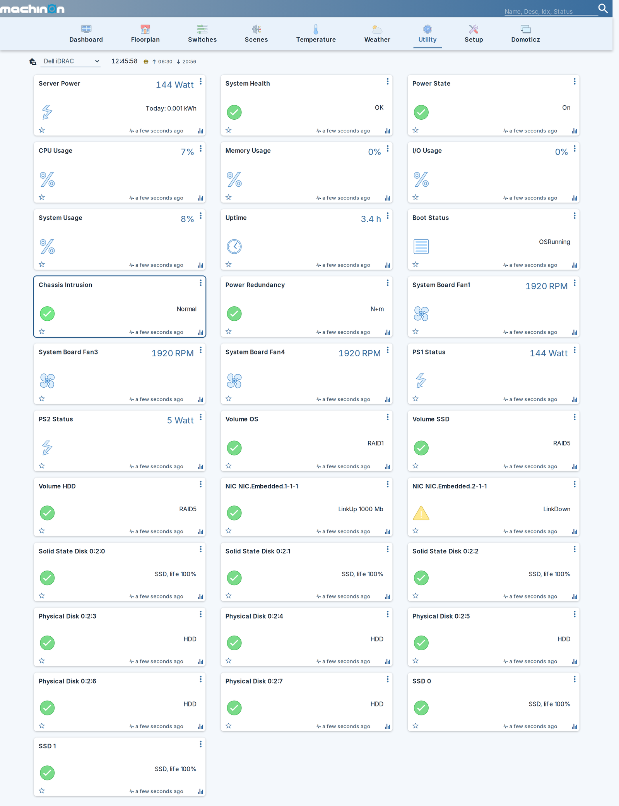

# Monitoring devices

The exact set of devices depends on what your server reports. Nothing is created for hardware the
iDRAC does not describe, and **a sensor that reports no reading produces no device at all**,
rather than a device reading zero.

!!! note
    Screenshots here use the [Machinon theme](https://domoticz.github.io/Machinon/). Device names
    and values are identical on the stock theme; only the presentation differs.

Every device the plugin creates on a 15G PowerEdge with three fans, two power supplies, three
RAID volumes, two NIC ports and ten drives:


## Core devices

These are created whenever the server reports the underlying value.

| Device | Domoticz type | Notes |
|---|---|---|
| Server Power | kWh | Live watts plus an energy counter. See [Energy](#energy). |
| System Health | Alert | One tile for overall health, which names the reason. See [System Health](#system-health). |
| Power State | Alert | `On` in green, `Off` in grey. Read-only. |
| Inlet Temp | Temperature | Chassis air intake. |
| Exhaust Temp | Temperature | Chassis air outlet. |
| CPU Usage | Percentage | |
| Memory Usage | Percentage | |
| I/O Usage | Percentage | |
| System Usage | Percentage | |
| Uptime | Custom, hours | Time since the host was powered on. |
| Boot Status | Text | For example `OSRunning`. |
| Chassis Intrusion | Alert | Green while the cover reports `Normal`. |
| Power Redundancy | Alert | See [Power redundancy](#power-redundancy). |

## Per-component devices

One device is created for each item the server reports:

- **CPU temperature**, one per socket.
- **Max DIMM temperature**, the hottest memory module the server tracks.
- **Fan speed**, one per fan, in RPM.
- **Power supply**, one per PSU, showing **input** watts.
- **RAID volume**, one alert per virtual disk, showing the RAID type.
- **NIC port**, one alert per port, showing link state and negotiated speed.
- **Physical drive**, one alert per disk, showing media type and predicted life where the drive
  reports it.

Fans, drives, volumes and NICs are re-discovered on every slow poll, so hardware added later
appears without reinstalling anything.

## Thresholds in the description

Temperature and fan devices carry the server's own warning and critical thresholds in the device
description, so you can see the limits without looking them up:

```
Inlet Temp        warning below 3 C; critical below -7 C; warning above 33 C; critical above 42 C
System Board Fan1 warning below 840 RPM; critical below 480 RPM
CPU1 Temp         critical below 3 C; warning above 83.3 C (estimated); critical above 98 C
```

A threshold marked **`(estimated)`** was not reported by the server. The plugin derives it from
the critical threshold so a warning band exists at all. Reported values are never labelled this
way, so an estimate can never be mistaken for something the server actually said.

Domoticz graphs every temperature device automatically, so the thresholds above sit alongside
real history:


## Bar graphs

Where the server reports thresholds, they also become a coloured bar across the top of the device
card, so the safe band is visible at a glance instead of being read out of the description text.

Fan cards show red below the critical speed, amber up to the warning speed, and green from there
to the [fan bar maximum](settings.md#devices) you set:


Two limitations worth knowing:

- **Temperature cards may not draw bars.** The plugin writes the ranges and Domoticz stores them,
  and you will see them pre-filled if you open the bar editor on a temperature device, but stock
  Domoticz does not currently render them on the card: it emits its bar element only for utility
  devices. Whether you see temperature bars therefore depends on your Domoticz version and theme.
  The plugin's side is the same either way.
- **Nothing else gets a bar.** Percentages, power supply wattage and the energy counter carry no
  server-reported thresholds, so any bands there would be invented rather than measured.

A **synthesized** threshold is never drawn. The description labels an estimated warning limit
`(estimated)`, but a coloured band carries no label, so drawing one would present a guess as a
reported limit. That is why the description and the bar can legitimately disagree on a sensor
whose warning threshold the server omits.

## System Health

This is deliberately a single tile rather than one per subsystem, because a wall of green tiles is
not information.

Its level is the worst of the standard Redfish health rollup and Dell's own OEM rollups. Its text
is the part that matters:

- When the iDRAC has raised a fault, the tile shows **the iDRAC's own message**, for example
  `Power supply redundancy is lost.`
- When there is no fault message, it falls back to naming the unhappy subsystems.
- When everything is healthy, it reads `OK`.

!!! info "Why the fault text matters so much"
    Dell's health rollups track **raised faults**, not instantaneous component state. During
    development a real power supply fault left the rollup Critical for hours while every single
    component, including both PSUs, reported `Status.Health: OK`. Without the fault text the tile
    would have been a permanently red square with nothing behind it that a user could act on.

## Power redundancy

Reports the health of the redundancy **group**, which is a different question from whether each
PSU is healthy. On the development machine this device read Critical while both power supplies
individually read OK, which is exactly the condition a per-component view cannot show you.

It reads in plain English rather than in Redfish terms, for example `Redundant, 2 supplies
(1 needed)`. The mode, the number of supplies in the set and the number needed all come from the
server. A fault reads `Redundancy lost` or `Redundancy degraded`.

!!! note "When a supply is physically removed"
    Pulling a power supply does not mark the group Critical: the iDRAC **removes the redundancy
    group entirely**. The device then reads a grey `Not reported`, rather than keeping its last
    value and claiming redundancy that no longer exists. It is grey rather than red because the
    plugin cannot tell why the group vanished; look at System Health, which carries the iDRAC's
    own fault text in that situation.

Only the first redundancy group is reported. Chassis that expose several groups will show only
one.

## Energy

The Server Power device carries both live watts and an accumulating kWh counter that the plugin
integrates itself from the measured wattage.

It does **not** use the lifetime energy figure the iDRAC reports. That counter is in watt-hours,
but it does not accumulate continuously: measured on two different servers it implied 17.6 W and
17.0 W lifetime averages for machines that draw far more than that, meaning it pauses across
power-off periods or resets. Wiring it to a Domoticz counter would produce a graph with invented
plateaus and sudden jumps.

The trade-off is that energy accrued while Domoticz is not running is not recovered. The counter
is guarded so it can only move forwards, and a implausibly large jump is held back and reported
rather than accepted.

All of the non-temperature devices appear under Domoticz's Utility tab:



## Power supply devices show input watts

A PSU device shows what the supply draws from the wall, which includes conversion loss, rather
than what it delivers to the board.

!!! warning "A PSU reading near 0 W is often completely normal"
    On a server configured for hot standby, one supply carries the load while the other idles near
    zero. Wattage alone is therefore **not** a fault signal, and the plugin never treats it as
    one. Health comes from the supply's reported status and from Power Redundancy.

## Device naming and unit numbers

Each device is created with a name derived from what the server calls the component. **If you
rename a device yourself, the plugin leaves your name alone** from then on; it only renames
devices whose name it still owns.

Unit numbers are allocated once per piece of hardware and then persist. If you remove hardware,
its device stays until you delete it, and its unit number is not handed to something else. This
keeps scenes, timers and scripts pointing at the same thing across a drive replacement.

## Icons

Fans get the Fan icon and Uptime the Clock icon when they are first created. If you pick a
different icon afterwards, the plugin never overwrites your choice.
