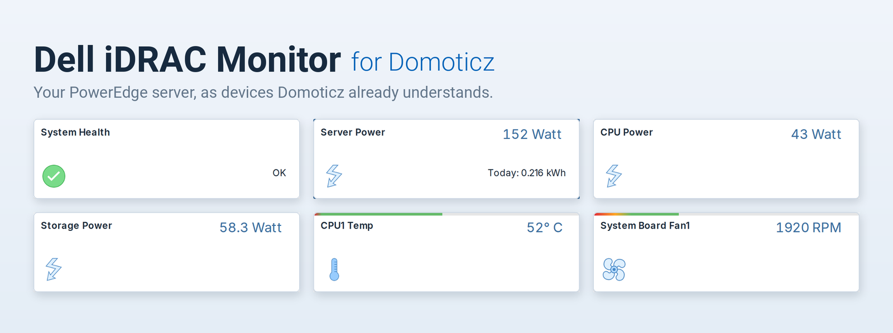
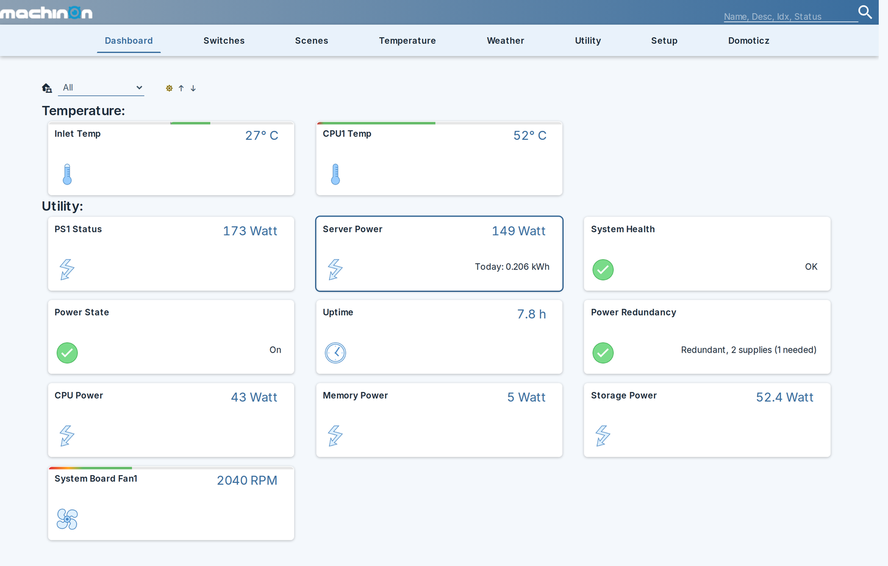

# Dell iDRAC Monitor for Domoticz

{ .hero }

Monitors a Dell PowerEdge server from Domoticz by reading its iDRAC over the Redfish API.

It creates Domoticz devices for the hardware your server **actually has**. A machine with three fans and eight drives gets three fan devices and eight drive devices, not a fixed list padded with empty tiles.

Read-only by default. Power control and the identify LED exist, but stay switched off until you deliberately enable them.

## What you get

- **Temperatures** for chassis inlet and exhaust, each CPU, and the hottest DIMM, each carrying the server's own warning and critical thresholds in its description.
- **Fan speeds**, one device per fan, with the low-speed thresholds the iDRAC reports.
- **Power**, as live watts plus an energy counter suitable for Domoticz's usage graphs, and per power-supply input wattage.
- **Utilization** for CPU, memory, I/O and the overall system.
- **Health** as a single tile that names the reason. When the iDRAC raises a fault, the tile shows the iDRAC's own words, for example `Power supply redundancy is lost.`
- **Storage**, one alert per physical drive and per RAID volume, named by media type and location, including predicted SSD life.
- **Network**, one alert per NIC port with link state and speed.
- **Power redundancy**, which can read Critical while every individual PSU still reports OK. That case is real, and it is the one a per-component view misses entirely.
- **Per-component power** on machines whose iDRAC licence allows it: CPU, memory, storage, fan, PCIe and FPGA draw as separate devices, plus per-GPU power and temperature where telemetry reports cards.

A dashboard of the devices worth keeping an eye on, picked as Domoticz favourites:

!!! tip "About the screenshots"
    The screenshots on this site use the [Machinon theme](https://domoticz.github.io/Machinon/) rather than the stock Domoticz look. If you like how these tiles read, it is a free drop-in theme for Domoticz and well worth a look. The plugin works identically on any theme.

## Design principles

**A missing reading never becomes a zero.** If a sensor reports no value, no device is written at all. The last known value stays on screen and Domoticz ages it out on its own. This matters more than it sounds: a single zero written into a temperature or energy device is in that device's history permanently.

**Nothing is assumed about the hardware.** Resource paths are discovered from the server rather than hardcoded, and sensor lookups carry known aliases per model, because the same physical probe genuinely has different ids on different PowerEdge models. Even the telemetry report that carries per-component power is chosen by the metrics it contains rather than by its name.

**Control is opt-in and two-staged.** Nothing can touch power until you say so, and the destructive actions need a second, separate opt-in on top. Configuration writes are a third, separate opt-in of their own.

## Where to go next

- [Installation](install.md) to get it running.
- [Settings](settings.md) for what every option does.
- [Monitoring devices](devices.md) for the full device list.
- [Power control](control.md) before you enable anything that can power off a server.
- [Security](security.md) for how credentials are stored and what TLS verification does.
- [Troubleshooting / FAQ](faq.md) when something looks wrong.
