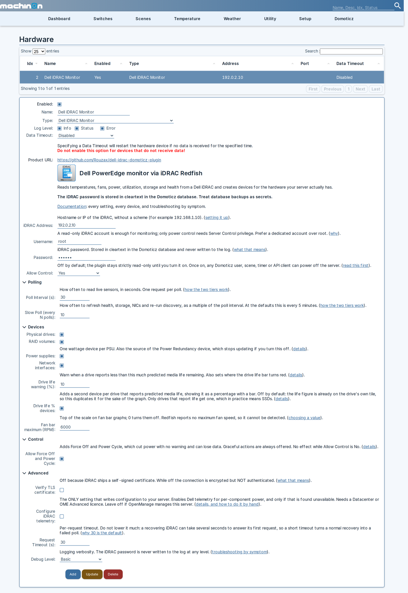
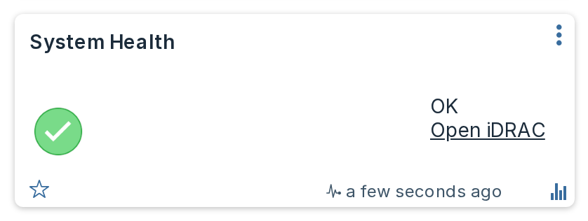

# Settings

Every setting lives on the hardware page in Domoticz: **Setup** then **Hardware**, then select the Dell iDRAC Monitor entry. Changing any of them restarts the plugin. Your devices and their history are kept.



Each setting carries its own explanation on that page, and a link to the matching section here.

## Connection

| Setting | Default | What it does |
|---|---|---|
| **iDRAC Address** | none | Hostname or IP of the iDRAC, with no scheme and no trailing path. A leading `https://` or `http://` is stripped for you, and a trailing `/` is removed. |
| **Username** | `root` | iDRAC account. A read-only account is enough for monitoring. |
| **Password** | none | Stored in the Domoticz database in cleartext. Never written to the log. See [Security](security.md). |
| **Allow Control** | `No` | Master switch for power actions and the identify LED. See [Power control](control.md). |

## Polling

| Setting | Default | Range | What it does |
|---|---|---|---|
| **Poll Interval (s)** | 30 | 20 to 600, step 10 | How often live sensors are read. |
| **Slow Poll (every N polls)** | 10 | 1 to 60 | How often the slower information is refreshed, as a **multiple** of the poll interval. At the defaults that is every 5 minutes. |

The plugin polls in two tiers because they cost very differently.

The **fast tier** is a single request for the sensor collection: temperatures, fan speeds, utilization and system power. That is what you want frequently. On a machine where [per-component power](devices.md#per-component-power-needs-a-licence) is available, the fast tier also reads the telemetry report that carries it, which is one further request.

The **slow tier** re-reads system health, the fault list, chassis state, power supplies, storage controllers, drives, volumes, network interfaces and the Dell attribute set, and re-runs discovery so newly added hardware appears. That is several requests, so running it every poll would put needless load on the iDRAC's management controller for information that changes rarely.

!!! note "Why the minimum is 20 seconds and the step is 10"
    Domoticz calls the plugin on a fixed 10-second heartbeat, and the plugin polls on the first heartbeat at or past your interval. A value that is not a multiple of 10 would therefore poll later than you asked. The manifest constrains the field so the setting cannot lie to you.

## Devices

These control which optional device families are created. Turning one off stops the plugin creating and updating those devices; it does **not** delete devices that already exist.

| Setting | Default | What it does |
|---|---|---|
| **Physical drives** | on | One alert device per physical disk. |
| **RAID volumes** | on | One alert device per virtual disk. |
| **Power supplies** | on | One wattage device per PSU. Also the source of the Power Redundancy device, see below. |
| **Network interfaces** | on | One alert device per NIC port. |
| **Drive life warning (%)** | 10 | Warn when a drive reports less predicted media life remaining than this. Only applies to drives that report the figure at all, which in practice means SSDs. |
| **Drive life % devices** | off | A second device per drive reporting predicted media life as a graphable percentage. See below. |
| **Formatted card text** | on | Renders System Health and Power Redundancy as a bullet list with a link to the iDRAC, instead of a single line of text. See below. |
| **Fan bar maximum (RPM)** | 6000 | Top of the scale on fan bar graphs. `0` switches fan bars off. See below. |

Turning off a family also skips the requests that fetch it, so on a server with many drives, switching **Physical drives** off measurably shortens the slow tier.

!!! warning "Power supplies also controls Power Redundancy"
    The redundancy group is reported inside the same Redfish payload as the power supplies, so switching **Power supplies** off stops the [Power Redundancy](devices.md#power-redundancy) device updating too. The device is not deleted; it simply stops receiving values and Domoticz ages it out. If you want redundancy monitoring, leave power supplies on.

### Drive life % devices

Every physical drive already reports its predicted media life on its own tile, as text such as `SSD, life 96%`. That tile is an Alert device, and Domoticz does not graph an Alert.

Switching this on adds a **second** device per drive, a Percentage carrying the same figure, which Domoticz does graph and which gets a [bar](devices.md#bar-graphs) coloured from your **Drive life warning (%)** setting. It is off by default because for most people the number on the drive's own tile is enough, and one extra device per drive adds up on a full chassis.

Only drives that actually report a life figure get one, which in practice means SSDs. The setting has no effect while **Physical drives** is off, since the life device hangs off the drive device.

### Formatted card text

Two devices, [System Health](devices.md#system-health) and [Power Redundancy](devices.md#power-redundancy), can show their facts as a formatted bullet list with a link to the iDRAC, instead of a single line of plain text. Nothing else is affected.

With it on, System Health lists its faults as bullets instead of joining them with semicolons, and Power Redundancy lists its facts (the configured policy, the supply counts, and the hot spare line when there is one) the same way. Both cards also gain a link reading **Open iDRAC** at the end, which opens the server's own web interface in a new tab. The link appears on every state, including a fault and an unknown reading.



With it off, both cards produce exactly the plain text the plugin has always produced, character for character.

!!! warning "This text is what dzVents and notifications see"
    The card text is the device's `sValue`, which is what a dzVents script compares against and what Domoticz notifications send. If you have a script or notification matching text such as `Redundancy lost`, either leave this setting off or update it to match the new wording; turning the setting on changes that text on the next poll.

**Requires Domoticz 2026.1 or newer**, the version from which Domoticz renders Text and Alert device data as HTML rather than as plain text. On an older build the markup may show as literal tags on the card instead of a bullet list, so turn this setting off there.

### Why the fan bar maximum is a setting

Redfish does not report a maximum fan speed, so the plugin cannot detect one. There is no sensible default either: on one tower server the three chassis fans topped out at 4920, 4920 and **5520** RPM, so even a single machine has no one maximum, and 1U servers run far faster again.

Pick a value a little above what your fans actually reach. If you do not know, run them at full speed once and read the devices, or leave the default.

A fan spinning faster than this setting is not a problem: the bar simply reads full and stays green. That is the correct reading for a fan, where a **low** speed is the fault and a high one just means it is working hard.

Changing this value updates the bars on the next poll, unless you have edited a fan's bands by hand, in which case your version is left alone.

## Device names

| Setting | Default | What it does |
|---|---|---|
| **Name prefix** | empty | Text put in front of every device name this plugin creates. |
| **Name suffix** | empty | Text appended to every device name this plugin creates. |

Both are empty by default, so an existing install is unaffected until you set one.

### Why you would want this

Device names are how dzVents looks devices up. The plugin names devices after the hardware, not after the server, so **two installs monitoring two servers produce the same names**: both create a device called `System Health`, both create `Inlet Temp`, both create `Server Power`. A dzVents lookup by name then silently picks one of them, and which one it picks is not something you can rely on.

Measured across six PowerEdge servers, **59 of the 186 distinct device names collided**, including nearly every headline tile. If you monitor more than one server, set a prefix or a suffix on at least all but one of them.

### The text is used exactly as you type it

Nothing is added and nothing is trimmed, so **include your own separator**, and the trailing space if you want one:

| You type | You get |
|---|---|
| `SERVER1 - ` | `SERVER1 - System Health` |
| `SERVER1` | `SERVER1System Health` |
| `_TESTSRV` (as suffix) | `System Health_TESTSRV` |

The trailing space in the first row is doing real work and is invisible in the settings form. To let you check it, the plugin writes one finished example to the Domoticz log the first time it applies an affix:

```
device names look like "SERVER1 - System Health"
```

Each field accepts up to 24 characters. A longer value is cut to 24 and the plugin says so in the log.

### Filling the name in from the server

Rather than typing the server's name, you can use a token and let the plugin read it from the machine:

| Token | What it expands to | Typical length |
|---|---|---|
| `{servicetag}` | Dell service tag, for example `65CBFV2` | 7 |
| `{hostname}` | OS host name, **cut at the first dot** | 10-15 |
| `{fqdn}` | OS host name exactly as reported | 12-27 |
| `{idrac}` | The iDRAC's own DNS name | 13-20 |
| `{model}` | Model, for example `PowerEdge R750` | 7-21 |

So a prefix of `{servicetag} - ` gives `65CBFV2 - System Health`, and a suffix of ` [{model}]` gives `System Health [PowerEdge R750]`. Tokens and plain text mix freely: `{model} {servicetag} - ` works.

`{hostname}` is cut at the first dot on purpose. Servers report host names inconsistently, some bare and some fully qualified, so passing the value straight through would give you `web01` on one machine and `web01.example.lan` on the next. Use `{fqdn}` if you genuinely want the whole thing.

Two things to know before choosing one:

- **`{model}` does not guarantee uniqueness.** Two identical servers report the same model. If your goal is to keep installs apart, `{servicetag}` is the only token that is unique per machine.
- **`{hostname}` needs the iDRAC Service Module** installed on the server. Without it the iDRAC does not know the OS host name.

If a token cannot be resolved, it expands to nothing and the plugin logs an error naming it. If that leaves the affix with no letters or digits at all, for example `{hostname} - ` on a machine that reports no host name, the affix is dropped completely rather than putting a stray ` - ` in front of every device.

### What happens when you change it

!!! warning "Changing this renames existing devices"
    On the next poll the plugin renames every device it still owns, so **any dzVents script that looks those devices up by name stops finding them**. Update your scripts in the same sitting. Devices you renamed by hand are never touched, because the plugin only renames names it set itself.

Setting a prefix on an install that already has devices is therefore a deliberate, one-off disruption, not a cosmetic change. Doing it before you write any automation is much easier than doing it after.

### Duplicate name warnings

The plugin warns you in the Domoticz log when the names it is about to use are already taken:

```
3 planned device name(s) already exist under hardware 'iDRAC T550': System Health,
Inlet Temp, Server Power. A dzVents lookup by name cannot tell them apart; set a
Name Prefix or Name Suffix.
```

This is checked once per plugin start, before any device is created, so the warning arrives on the first poll rather than after a full set of duplicates exists. It looks at **every** device in your Domoticz install, so it catches a second copy of this plugin, an unrelated piece of hardware that happens to own the name, and a dummy device you made yourself.

The plugin only warns. It does not rename anything automatically to dodge a collision, because the name it invented would depend on which install happened to poll first, and an unpredictable name is no more useful to a script than a duplicate one.

## Control

| Setting | Default | What it does |
|---|---|---|
| **Allow Force Off and Power Cycle** | off | Adds the two hard power actions to the Power Control selector. |

This is inert while **Allow Control** is `No`: with control off, no control device is created at all and every command is refused. Read [Power control](control.md) before enabling either.

## Advanced

| Setting | Default | Range | What it does |
|---|---|---|---|
| **Verify TLS certificate** | off | | Off because an iDRAC ships a self-signed certificate. While off, traffic is encrypted but **not authenticated**. See [Security](security.md). |
| **Configure iDRAC telemetry** | off | | Switches Dell telemetry on so per-component power devices can appear. The only setting that writes configuration to your server. See below. |
| **Request Timeout (s)** | 30 | 5 to 120, step 5 | Per-request timeout. |
| **Debug Level** | `None` | | `Basic` and `Verbose` add detail to the Domoticz log. The password is never logged at any level. |

### Configure iDRAC telemetry

[Per-component power](devices.md#per-component-power-needs-a-licence) comes from Dell's telemetry service, which is licence-gated and switched off by default on the iDRAC. Turning this setting on lets the plugin switch it on for you.

This is the **only** setting that makes the plugin write configuration to your server, so it has deliberate limits:

- It acts **only** when per-component power was already found to be unavailable. On a machine where telemetry is already working, including one managed by OpenManage Enterprise, the plugin never touches the configuration.
- It writes exactly two iDRAC attributes, `Telemetry.1.EnableTelemetry` and `TelemetryPowerMetrics.1.EnableTelemetry`, both set to `Enabled`, and nothing else.
- It tries **once per plugin start**. A machine that cannot be fixed this way, because the licence does not allow it, is not written to again on every poll.
- It says what it did in the Domoticz log, at Status level, before it does it.

If the licence does not permit telemetry you will see:

```
Error: Dell iDRAC Monitor: could not configure iDRAC telemetry, which usually means the licence
does not allow it: ...
```

Leave this off if OpenManage manages the server, or if you would rather set the two attributes yourself from the iDRAC interface or with `racadm`.

!!! danger "Do not lower Request Timeout much"
    A recovering iDRAC can take several seconds to answer its first request after a restart, sometimes the better part of ten. A short timeout turns a normal recovery into a failed poll and starts a backoff you did not need. The 30 second default is deliberate.

## When a setting is adjusted for you

If a value is out of range or unreadable, the plugin clamps or falls back to the default and says so in the log at Status level, for example:

```
Status: Dell iDRAC Monitor: setting adjusted: PollInterval: 5 is outside 20-600, using 20
```

A silently rewritten setting you never see is worse than a wrong one you can spot, so these are always reported rather than applied quietly.
